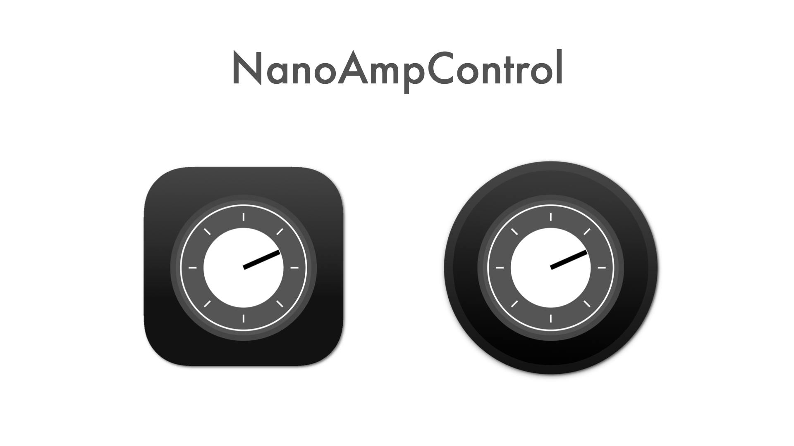
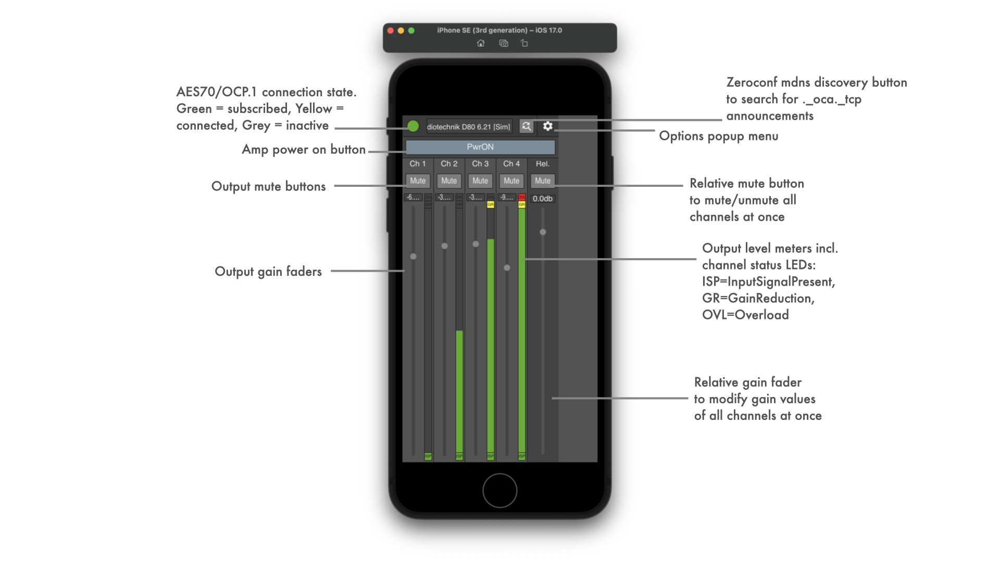

SurroundFieldMixer is a programming experiment to try out ideas on a gain/delay processing matrix to feed ITU-775 surround sound systems using JUCE framework.

Its sourcecode and prebuilt binaries are made publicly available to enable interested users to experiment, extend and create own adaptations.

Use what is provided here at your own risk!

