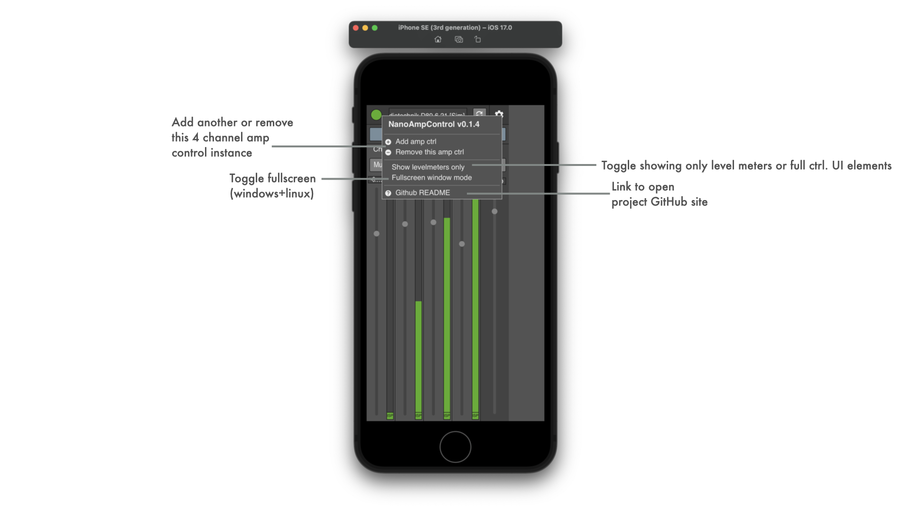
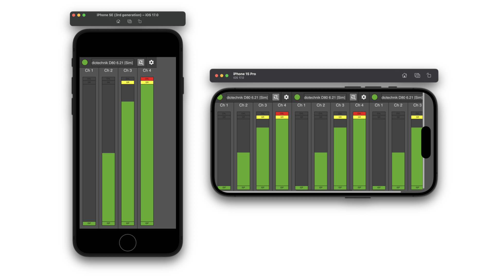
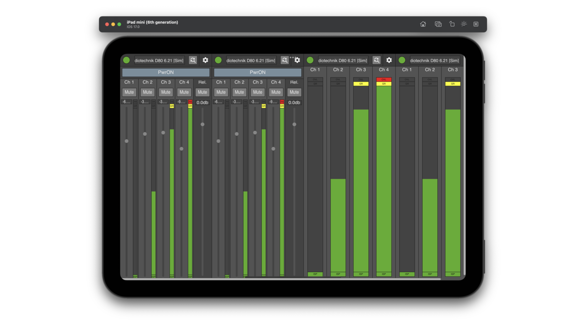
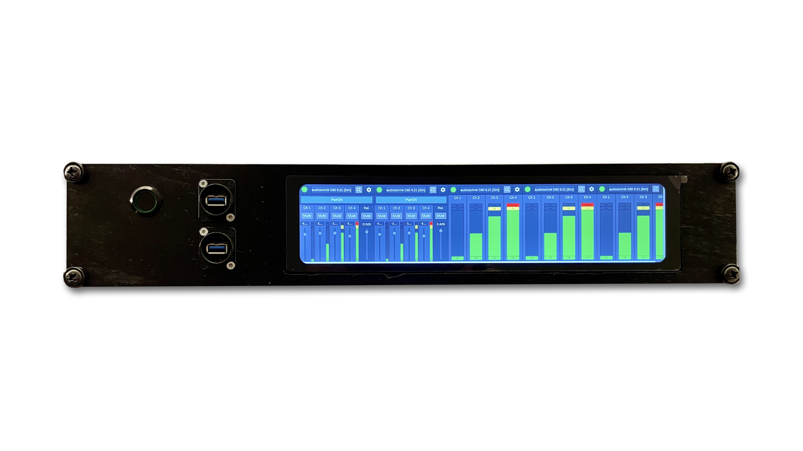

NanoAmpControl is a **PRIVATELY** created and driven project and is a programming experiment to try out ideas on a desktop/mobile app to control d&b 4-ch amplifiers via AES70/OCP.1 using JUCE framework.

Usecases may be controlling a single amp from a smartphone app, multiple amplifiers from a tablet app or even many amps in 'levelmeter only' mode on a embedded ultra widescreen.

Its sourcecode and prebuilt binaries are made publicly available to enable interested users to experiment, extend and create own adaptations.

See [LATEST RELEASE](../../releases/latest) for available binary packages or join iOS TestFlight Beta:

**Use what is provided here at your own risk!**

# Used modules
It uses multiple submodules to integrate the required functionality:
| Submodule | Purpose | Weblink |
|:----------|:--------|:--------|
| NanoOcp | minimal AES70/OCP.1 protocol implementation incl. TCP/IP socket handling through JUCE Framework | https://github.com/ChristianAhrens/NanoOcp |
| JUCE-AppBasics | Various JUCE Framework utility extention classes | https://github.com/ChristianAhrens/JUCE-AppBasics |
| ZeroconfSearcher | UI element based on JUCE Framework to discover mdns announcements | https://github.com/ChristianAhrens/ZeroconfSearcher |
| JUCE | UI Framework | https://github.com/juce-framework/JUCE |
| create-dmg | Helper tool for macOS DiskImage creation | https://github.com/create-dmg/create-dmg |

# UserInterface
## Overview

## Options popup

# Usecase smartphone metering

# Usecase tablet control+metering

# Usecase embedded rack device control+metering
